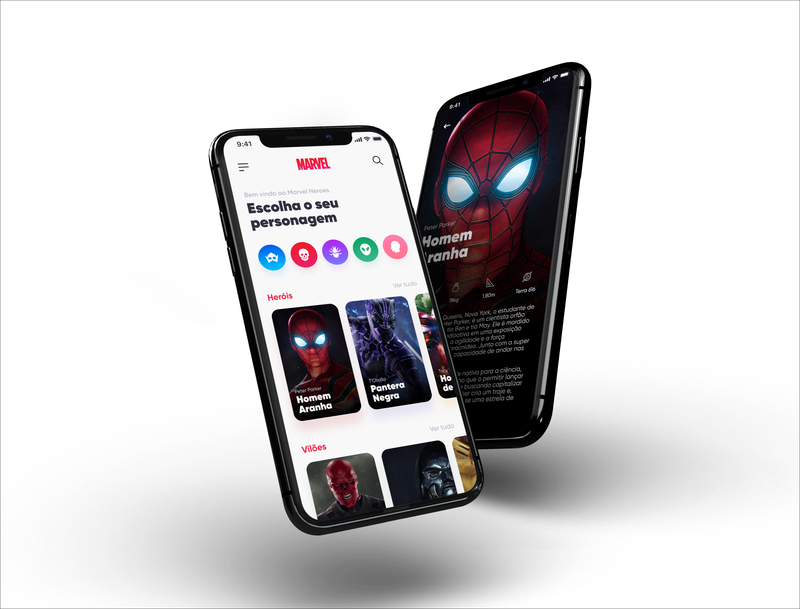
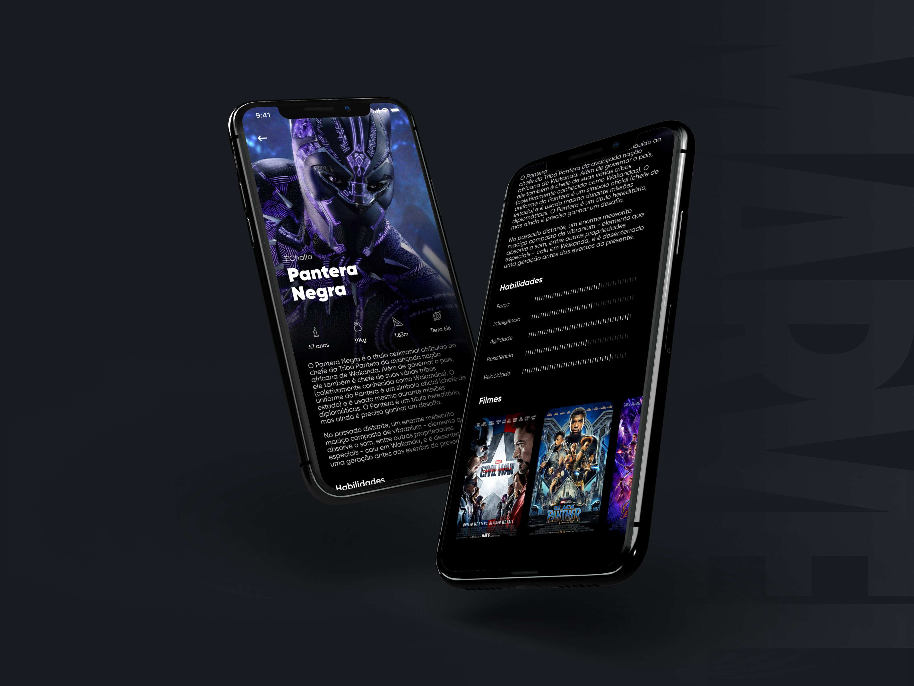
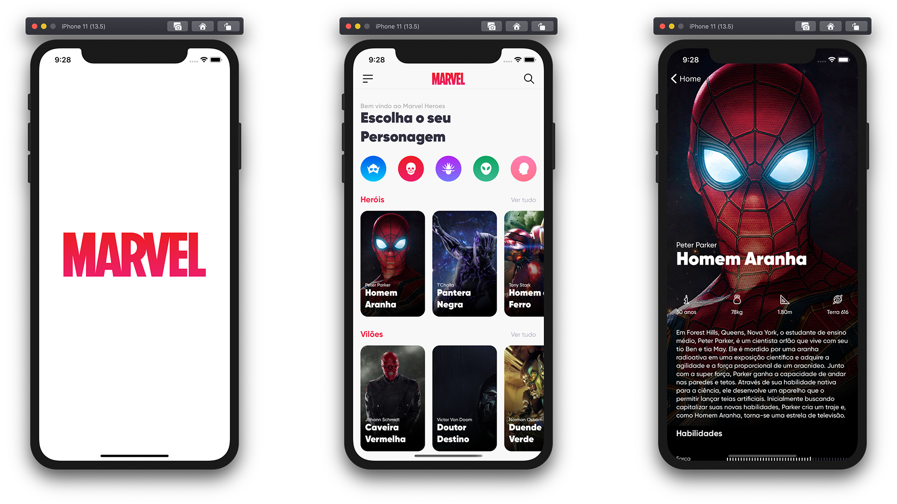
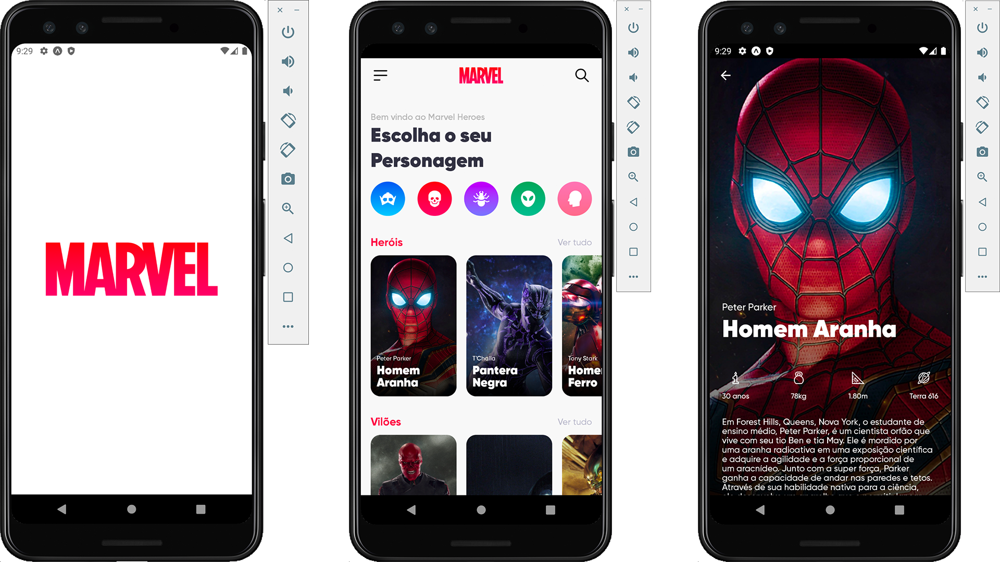

<h1 align="center">
    
</h1>

<h4 align="center">
  Marvel Heroes 👨🏻‍🎤
</h4>

  

  

  

  

  

  <a href="#rocket-Technology">Technology</a>&nbsp;&nbsp;&nbsp;|&nbsp;&nbsp;&nbsp;
  <a href="#-Project">Project</a>&nbsp;&nbsp;&nbsp;|&nbsp;&nbsp;&nbsp;
  <a href="#-How-to-contribute">How to contribute</a>&nbsp;&nbsp;&nbsp;|&nbsp;&nbsp;&nbsp;
  <a href="#memo-License">License</a>

 

  

  

  

  

## :rocket: Technology

This project was developed with the following technologies:

- [Node.js](https://nodejs.org/en/)
- [React Native](https://reactjs.org)
- [Typescript](https://www.typescriptlang.org/)

Libs:

- [EditorConfig](https://editorconfig.org/)
- [ESLint](https://eslint.org/)
- [Prettier](https://prettier.io/)
- [Expo](https://airbnb.design/lottie/)
- [Expo Linear Gradient](https://docs.expo.io/versions/latest/sdk/linear-gradient/)
- [React Native Image Cache](https://github.com/wcandillon/react-native-expo-image-cache)
- [React Native Shared Element](https://github.com/IjzerenHein/react-native-shared-element)
- [StyledComponents](https://styled-components.com/)

Para mais detalhes, veja o <kbd>[package.json](./package.json)</kbd>

## 💻 Project

Welcome to Marvel Heroes! This is [umpontoseis](https://github.com/umpontoseis) second project created from designers to developers, which brings with it the aim of perfecting our skills and strengthening professional ties.

## 🤔 How to contribute

- Fork this repository;
- Create a branch with your feature: `git checkout -b my-feature`;
- Commit your changes: `git commit -m 'feat: My new feature'`;
- Push to your branch: `git push origin my-feature`.

After the merge of your pull request is done, you can delete your branch.

## :memo: License

This project is under the MIT license. See the file [LICENSE](LICENSE.md) for more details.

---

Made with ♥ by Vinnicius Gomes
